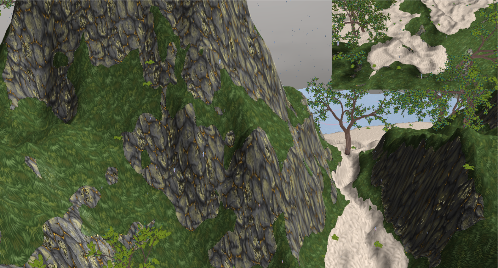
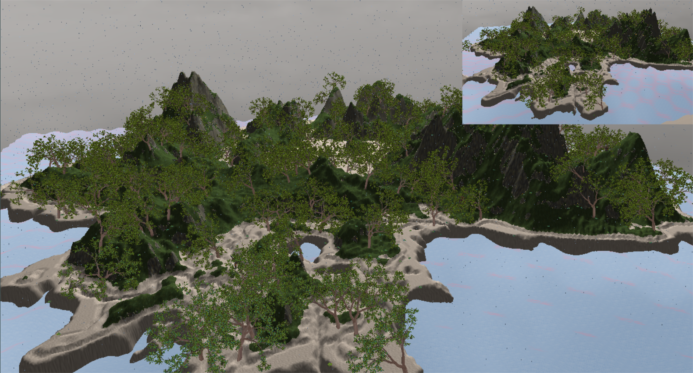

# Advanced-Graphics-Coursework
An OpenGL scene created for the advanced graphics for games module

- The scene features an island landscape with textures for rock, sand, and grass terrains.
- The terrain is lit by a single light source and the shader includes calculations for ambient, diffuse and specular lighting.

- The scene includes a skybox which is also reflected by the water. 
- When the scene starts, the camera starts automatically circling the island.
- Everything in the scene is derived from the SceneNode class and are added to a single root node for efficient rendering.

- The scene includes vegetation such as trees and ferns.
- Blurring and screen shaking effects were implemented and are applied to the scene using the control buttons.

- The scene includes two viewpoints being rendered.

- Animated models are randomly scattered throughout the scene.

- The scene includes rain and lightning strike effects.
